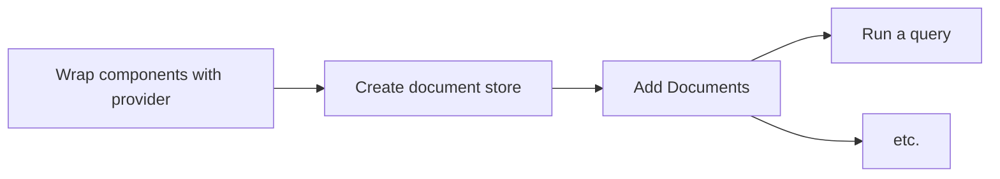

# react-browser-search

### [**-> Take a look at the demo**](https://youldali.github.io/browser-search/)

This library provides react hooks to the [browser-search library](https://github.com/youldali/browser-search)
Please read the documentation of [browser-search](https://github.com/youldali/browser-search) before using


## Table of contents
- [react-browser-search](#react-browser-search)
    - [**-> Take a look at the demo**](#--take-a-look-at-the-demo)
  - [Get Started](#get-started)
    - [Installation](#installation)
    - [Usage flow](#usage-flow)
    - [Step 1 - Wrap your component tree in  the react-browser-search provider](#step-1---wrap-your-component-tree-in--the-react-browser-search-provider)
    - [Step 2 - Create a store](#step-2---create-a-store)
    - [Step 3 - Add documents](#step-3---add-documents)
    - [Step 4 - run a search query](#step-4---run-a-search-query)
- [API Methods](#api-methods)
  - [useCreateStore](#usecreatestore)
    - [Signature](#signature)
    - [Example](#example)
  - [useAddDataToStore](#useadddatatostore)
    - [Signature](#signature-1)
    - [Example](#example-1)
  - [useQuery](#usequery)
    - [Signature](#signature-2)
    - [Example](#example-2)
  - [useIndexValues](#useindexvalues)
    - [Signature](#signature-3)
    - [Example](#example-3)
  - [useDeleteStore](#usedeletestore)
    - [Signature](#signature-4)
    - [Example](#example-4)
    - [Example](#example-5)
  - [BrowserSearchProvider](#browsersearchprovider)
    - [Example](#example-6)


## Get Started
### Installation
**Yarn**

    yarn add @browser-search/browser-search
    yarn add @browser-search/react-browser-search
**Npm**

    npm install -S @browser-search/browser-search
    npm install -S @browser-search/react-browser-search

### Usage flow


### Step 1 - Wrap your component tree in  the react-browser-search provider
For the hooks to the work, you need to wrap them to the provider which contains a client + cache layer.
See [BrowserSearchProvider](#BrowserSearchProvider) for usage

### Step 2 - Create a store
Before anything, you need to create a store that will later hold your data.
You need to know in advance 
- the type of the documents you will store
- the fields that you will use for filtering / sorting. Those fields must be indexed.
See [useCreateStore](#useCreateStore)

### Step 3 - Add documents
Then you can add documents to the newly created store
See [useAddDataToStore](#useAddDataToStore)

### Step 4 - run a search query
You can now run complex queries to filter and sort your document, and display them to your users.
See [useQuery](#useQuery) for usage

# API Methods

## useCreateStore
[see createStore](https://github.com/youldali/browser-search/tree/master#createstore)

### Signature
```typescript
<DataSchema>(): [(request: RequestPayload<DataSchema>) =>  Promise<void>, QueryState<DataSchema>]
```

#### Generics
- `DataSchema` is the type of the document you will store

#### Parameters
- `request: RequestPayload<DataSchema>` is the object containing the request for the store creation
	- `storeId: string` the name of the store to create
	- `indexConfig: SimplifiedIndexConfig<DataSchema>` the fields to index. [see reference here](https://github.com/youldali/browser-search/tree/master#SimplifiedIndexConfig)
	- `keyPath: keyof  DataSchema` is the field which is be the primary key. That field does not need to be included in the `indexConfig` above

####  Return value

    [(request: RequestPayload<DataSchema>) =>  Promise<void>, UseCreateStoreQueryState<DataSchema>]

### Example
Let's say we want to store **books** of the following type:
```typescript
export  interface  Book {
	isbn: string; // primary key
	title: string;
	releaseDate: string;
	authors: string[];
	categories: Array<'fantasy' | 'sci-fi' | 'thriller'>;
	description: string;
}
```
We want to be able to filter and sort on every field but the description.
```typescript
import { SimplifiedIndexConfig } from '@browser-search/browser-search';
import { useCreateStore, UseCreateStoreQueryState } from  '@browser-search/react-browser-search';

const storeName = "bookLibrary";
const indexConfig: SimplifiedIndexConfig<Book> = {
	simple: ['title', 'releaseDate'],
	array: ['authors', 'categories'] // every field which is an array
};
const keyPath = 'isbn';

const  useCreateLibraryStore = (): [() =>  Promise<void>, UseCreateStoreQueryState<Book>] => {

	const [createStore, createStoreQueryState] = useCreateStore<Book>();
	const  createLibraryStore = () =>  createStore({
	  storeId,
	  indexConfig,
	  keyPath,
	});

	return [createPersonStore, createStoreQueryState];
};
```

## useAddDataToStore
[see addDataToStore](https://github.com/youldali/browser-search/tree/master#addDataToStore)

### Signature
```typescript
<DataSchema>(): [(request: RequestPayload<DataSchema>) =>  Promise<void>, UseAddDataToStoreQueryState<DataSchema>]
```

#### Generics
- `DataSchema` is the type of the document you will store

#### Parameters
- `request: RequestPayload<DataSchema>` is the object containing the request to add the data to the store
	- `storeId: string` the name of the store to create
	- `data: DataSchema[]` is the array of documents to be stored

####  Return value

    [(request: RequestPayload<DataSchema>) =>  Promise<void>, UseAddDataToStoreQueryState<DataSchema>]

### Example

```typescript
import { useAddDataToStore } from  '@browser-search/react-browser-search';

const storeId = 'bookLibrary';

const useAddBooksToLibraryStore = (): [(books: Book[]) =>  Promise<void>, UseAddDataToStoreQueryState<Book>] => {
	const [addDataToStore, addDataToStoreQueryState] = useAddDataToStore<Person>();

	const addBooksToLibraryStore = (books) => {
		return addDataToStore({
			storeId,
			data: books
		})
	}

	return [addBooksToLibraryStore, addDataToStoreQueryState];
}
```

## useQuery
[see searchStore](https://github.com/youldali/browser-search/tree/master#searchStore)

- Any search results will be cached.
- The cache is automatically invalidated on any store mutation and the request is re-triggered
- Any request automatically cancels a previously sent (and unfinished) request

### Signature
```typescript
<Document, TFilterId  extends  string = string>(request: BS.Request<Document, TFilterId>): UseQueryQueryState<Document, TFilterId>
```

#### Generics
- `Document` is the type of the document you will store
- `TFilterId` is the string union of all the filters ids defined in the filterConfiguration object, passed in the request. Defaults to a string.

#### Parameters
- `request: BS.Request<Document, TFilterId>` is the object containing the search parameters.
	- `storeId: string`: the store name
	- `filterConfig: FilterConfig<T, TFilterId>`: the filter configuration object describes all the different filters of your UI.  [See reference](https://github.com/youldali/browser-search/tree/master#FilterConfig)
	- `filtersApplied: FilterId[]`: the list of the **ids** of the filters applied. The ids come from the `id` property in the filter definition of the `filterConfig`
	- `orderBy?: keyof T = undefined:` (optional) the property name on which to sort the data (must be part of the indexConfig when creating the store)
	- `orderDirection?: 'ASC' | 'DESC' = 'ASC'`: (optional) the direction in which sort the data (ascending / descending). 
	- `page? = 0`: (optional) The search is paginated. So you will only receive the documents matching between [page * perPage, (page + 1) * perPage]
	- `perPage?: number = 20`: (optional) the maximum number of documents returned

####  Return value 

    UseQueryQueryState<Document, TFilterId>

### Example

```typescript
import { useAddDataToStore } from  '@browser-search/react-browser-search';

type  FilterIds = 'categoryFantasy' | 'categorySciFi' | 'categoryThriller';
const storeId = 'bookLibrary';


export  const  useBookQuery = (): UseQueryQueryState<Book, FilterId> => {
	const filterConfig: FilterConfig<Book, FilterIds> = 
	[
		[
			{ id:  'categoryFantasy', field: 'categories', operator: 'contains', operand:  'fantasy' },
			{ id:  'categorySciFi', field: 'categories', operator: 'contains', operand: 'sci-fi' },
			{ id:  'categoryThriller', field: 'categories', operator: 'contains', operand:  'thriller' },
		],
	];
	
	const  request: Request<Person, FilterId> = () => (
		storeId,
		filterConfig,
		filtersApplied: ['categoryFantasy', 'categorySciFi'], // the ids of the filter in the filter configuration that you are filtering on
		orderBy:  'releaseDate',
		orderDirection: 'DESC',
		perPage:  10,
		page:  0,
	};

	return  useQuery<Book, FilterId>(request);
}
```

## useIndexValues
[see getAllValuesOfProperty](https://github.com/youldali/browser-search/tree/master#getAllValuesOfProperty)

- The request is re-triggered on any store mutation

### Signature
```typescript
<T  extends  IDBValidKey>(storeId: StoreId, indexId: IndexId): UseIndexValuesQueryState<T>
```

#### Generics
- `T` is the type of the property indexed, that should be compliant with the `IDBValidKey` interface, where `IDBValidKey = number | string | Date | BufferSource | IDBValidKey[]` 

#### Parameters
- `request: BS.Request<T>` is the object containing the request parameters.
	- `storeId: string`: the store name
	- `indexId: string` is the property for which you want to get all the values. It should be indexed at the store creation. [See SimplifiedIndexConfig reference](https://github.com/youldali/browser-search/tree/master#SimplifiedIndexConfig)

####  Return value 

    UseIndexValuesQueryState<T>

### Example

```typescript
import { useIndexValues, UseIndexValuesQueryState } from  '@browser-search/react-browser-search';

const storeId = 'bookLibrary';

// to get the list of all the titles stored
export const  useBookTitleValues = (): UseIndexValuesQueryState<string[]> => {
	return  useIndexValues<string>({
		storedId,
		indexId: 'title',
	});
}
```

## useDeleteStore
[see deleteStore](https://github.com/youldali/browser-search/tree/master#deleteStore)

### Signature
```typescript
(): [(request: RequestPayload) =>  Promise<void>, QueryState]
```

#### Parameters
- `request: RequestPayload<DataSchema>` is the object containing the request for the store deletion
	- `storeId: string` the name of the store to create

####  Return value

    [(request: RequestPayload<DataSchema>) =>  Promise<void>, UseCreateStoreQueryState<DataSchema>]

### Example

```typescript
import { useDeleteStore, UseDeleteStoreQueryState } from  '@browser-search/react-browser-search';

const storeName = "bookLibrary";

const  useDeleteLibraryStore = (): [() =>  Promise<void>, UseDeleteStoreQueryState] => {

	const [deleteStore, deleteStoreQueryState] = useDeleteStore();
	const  deleteLibraryStore = () =>  deleteStore({
	  storeId,
	});

	return [deleteLibraryStore, deleteStoreQueryState];
};
```

#### Parameters
- `request: RequestPayload<DataSchema>` is the object containing the request for the store deletion
	- `storeId: string` the name of the store to create

####  Return value

    [(request: RequestPayload<DataSchema>) =>  Promise<void>, UseCreateStoreQueryState<DataSchema>]

### Example

```typescript
import { useDeleteStore, UseDeleteStoreQueryState } from  '@browser-search/react-browser-search';

const storeName = "bookLibrary";

const  useDeleteLibraryStore = (): [() =>  Promise<void>, UseDeleteStoreQueryState] => {

	const [deleteStore, deleteStoreQueryState] = useDeleteStore();
	const  deleteLibraryStore = () =>  deleteStore({
	  storeId,
	});

	return [deleteLibraryStore, deleteStoreQueryState];
};
```

## BrowserSearchProvider
This react component connects your tree to the browser-search context
- any component calling a browser-search hook should be a child of this one

### Example

```typescript
import { BrowserSearchProvider } from  '@browser-search/react-browser-search';


<BrowserSearchProvider>
	<App />
</BrowserSearchProvider>
```