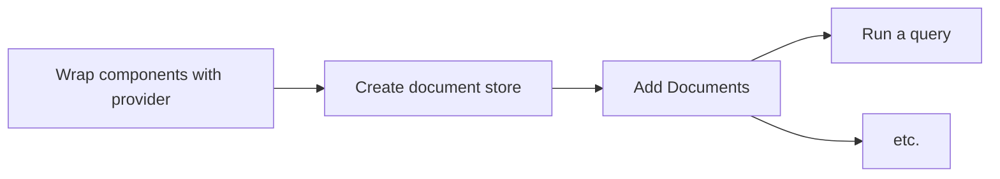
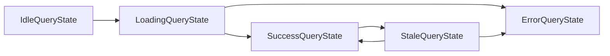

# react-browser-search

### [**-> Take a look at the demo**](https://youldali.github.io/browser-search/)

This library provides react hooks to the [browser-search library](https://github.com/youldali/browser-search)
Please read the documentation of [browser-search](https://github.com/youldali/browser-search) before using


- [Get Started](#get-started)
	- [Installation](#installation)
	- [Usage flow](#usage-flow)
- [API Methods](#api-methods)
	- [useCreateStore](#usecreatestore)
		- [Signature](#signature)
		- [Example](#example)
	- [useAddDocumentsToStore](#useadddocumentstostore)
		- [Signature](#signature-1)
		- [Example](#example-1)
	- [useQuery](#usequery)
		- [Signature](#signature-2)
		- [Example](#example-2)
	- [useIndexValues](#useindexvalues)
		- [Signature](#signature-3)
		- [Example](#example-3)
	- [useDeleteStore](#usedeletestore)
		- [Signature](#signature-4)
		- [Example](#example-4)
	- [BrowserSearchProvider](#browsersearchprovider)
		- [Example](#example-5)
- [API Interfaces](#api-interfaces)
	- [QueryState](#querystate)
		- [Definition](#definition)

## Get Started
### Installation
**Yarn**

    yarn add @browser-search/browser-search
    yarn add @browser-search/react-browser-search
**Npm**

    npm install -S @browser-search/browser-search
    npm install -S @browser-search/react-browser-search

### Usage flow


### Step 1 - Wrap your component tree in  the react-browser-search provider
For the hooks to work, you need to wrap your component tree in the provider which contains a client + cache layer.
See [BrowserSearchProvider](#BrowserSearchProvider) for usage

### Step 2 - Create a store
To get started, create a store that will later hold your data.
You need to know in advance 
- the type of the documents you will store
- the fields that you will use for filtering / sorting. Those fields must be indexed.
See [useCreateStore](#useCreateStore)

### Step 3 - Add documents
Then you can add documents to the newly created store
See [useAddDocumentsToStore](#useAddDocumentsToStore)

### Step 4 - run a search query
You can now run complex queries to filter and sort your document, and display them to your users.
See [useQuery](#useQuery) for usage

# API Methods

## useCreateStore
[see createStore](https://github.com/youldali/browser-search/tree/master#createstore)

### Signature
```typescript
<TDocument>(): [(request: CreateStoreRequest<TDocument>) =>  Promise<void>, QueryState<TDocument>]
```

#### Generics
- `TDocument` is the type of the document you will store

#### Parameters
none

####  Return value

```typescript
[(request: CreateStoreRequest<TDocument>) =>  Promise<void>, QueryState<TDocument>]
```
**With**
- `request: CreateStoreRequest<TDocument>` is the object containing the request for the store creation
	- `storeId: string` the name of the store to create
	- `indexConfig: SimplifiedIndexConfig<DataSchema>` the fields to index. [see reference here](https://github.com/youldali/browser-search/tree/master#SimplifiedIndexConfig)
	- `keyPath: keyof TDocument` is the field which is be the primary key. That field does not need to be included in the `indexConfig` above
- `queryState: UseCreateStoreQueryState`: see [QueryState](#QueryState)

### Example
Let's say we want to store **books** of the following type:

```typescript
export  interface  Book {
	isbn: string; // primary key
	title: string;
	releaseDate: string;
	authors: string[];
	categories: Array<'fantasy' | 'sci-fi' | 'thriller'>;
	description: string;
}
```
We want to be able to filter and sort on every field but the description.
```typescript
import { SimplifiedIndexConfig } from '@browser-search/browser-search';
import { useCreateStore, UseCreateStoreQueryState } from  '@browser-search/react-browser-search';

const storeName = "bookLibrary";
const indexConfig: SimplifiedIndexConfig<Book> = {
	simple: ['title', 'releaseDate'],
	array: ['authors', 'categories'],
};
const keyPath = 'isbn';

const  useCreateLibraryStore = (): [() =>  Promise<void>, UseCreateStoreQueryState<Book>] => {

	const [createStore, createStoreQueryState] = useCreateStore<Book>();
	const  createLibraryStore = () =>  createStore({
	  storeId,
	  indexConfig,
	  keyPath,
	});

	return [createPersonStore, createStoreQueryState];
};
```

## useAddDocumentsToStore
[see addDocumentsToStore](https://github.com/youldali/browser-search/tree/master#addDocumentsToStore)

### Signature
```typescript
<TDocument>(): [(request: AddDocumentsToStoreRequest<TDocument>) =>  Promise<void>, QueryState<TDocument>]
```

#### Generics
- `TDocument` is the type of the document you will store

#### Parameters
 none 

####  Return value
```typescript
[(request: AddDocumentsToStoreRequest<TDocument>) =>  Promise<void>, QueryState<TDocument>]
```
**With**
- `request: AddDocumentsToStoreRequest<TDocument>` is the object containing the request to add the data to the store
	- `storeId: string` the name of the store to create
	- `documents: TDocument[]` is the array of documents to be stored
- `queryState: UseAddDocumentsToStoreQueryState`: see [QueryState](#QueryState)
	
### Example

```typescript
import { useAddDocumentsToStore, UseAddDocumentsToStoreQueryState } from  '@browser-search/react-browser-search';

const storeId = 'bookLibrary';

const useAddBooksToLibraryStore = (): [(books: Book[]) =>  Promise<void>, UseAddDocumentsToStoreQueryState<Book>] => {
	const [addDocumentsToStore, addDocumentsToStoreQueryState] = useAddDocumentsToStore<Person>();

	const addBooksToLibraryStore = (books: Book[]) => {
		return addDataToStore({
			storeId,
			documents: books
		})
	}

	return [addBooksToLibraryStore, addDocumentsToStoreQueryState];
}
```

## useQuery
[see queryStore](https://github.com/youldali/browser-search/tree/master#queryStore)

Hook behaviour:
- Every query response is cached
- The cache is automatically invalidated at any store mutation and the request is automatically re-triggered
- A request automatically cancels a previously pending request

### Signature
```typescript
<TDocument, TFilterId  extends  string = string>(request: QueryRequest<TDocument, TFilterId>): QueryState<TDocument, TFilterId>
```

#### Generics
- `TDocument` is the type of the document you will store
- `TFilterId` is the string union of all the filters ids defined in the filterConfiguration object, passed in the request. Defaults to a string.

#### Parameters
- `request: QueryRequest<TDocument, TFilterId>` is the object containing the query parameters. Refer to [QueryRequest](https://github.com/youldali/browser-search/tree/master#QueryRequest)

####  Return value 

    UseQueryQueryState<TDocument, TFilterId>
see [QueryState](#QueryState)
### Example

```typescript
import { useQuery, UseQueryQueryState } from  '@browser-search/react-browser-search';
import { QueryRequest, FilterConfig } from  '@browser-search/browser-search';

type  FilterIds = 'categoryFantasy' | 'categorySciFi' | 'categoryThriller';
const storeId = 'bookLibrary';


export  const  useBookQuery = (filterApplied: FilterIds[]): UseQueryQueryState<Book, FilterId> => {
	const filterConfig: FilterConfig<Book, FilterIds> = 
	[
		[
			{ id:  'categoryFantasy', field: 'categories', operator: 'contains', operand:  'fantasy' },
			{ id:  'categorySciFi', field: 'categories', operator: 'contains', operand: 'sci-fi' },
			{ id:  'categoryThriller', field: 'categories', operator: 'contains', operand:  'thriller' },
		],
	];
	
	const  queryRequest: QueryRequest<Person, FilterId> = () => (
		storeId,
		filterConfig,
		filtersApplied, // the ids of the filter in the filter configuration that you are filtering on. Example: ['categoryFantasy', 'categorySciFi']
		orderBy:  'releaseDate',
		orderDirection: 'DESC',
		perPage:  10,
		page:  0,
	};

	return  useQuery<Book, FilterId>(queryRequest);
}
```

## useIndexValues
[see getIndexValues](https://github.com/youldali/browser-search/tree/master#getIndexValues)

Hook behaviour:
- Every query response is cached.
- The cache is automatically invalidated on any store mutation and the request is automatically re-triggered

### Signature
```typescript
<T  extends  IDBValidKey>({storeId, field}: GetIndexValuesRequest): QueryState<T>
```

#### Generics
- `T` is the type of the property indexed, that should be compliant with the `IDBValidKey` interface, where `IDBValidKey = number | string | Date | BufferSource | IDBValidKey[]` 

#### Parameters
- `request: GetIndexValuesRequest` is the object containing the request parameters.
	- `storeId: string`: the store name
	- `field: string` is the property for which you want to get all the values. It should be indexed at the store creation. [See SimplifiedIndexConfig reference](https://github.com/youldali/browser-search/tree/master#SimplifiedIndexConfig)

####  Return value 

    UseIndexValuesQueryState<T>
see [QueryState](#QueryState)

### Example

```typescript
import { useIndexValues, UseIndexValuesQueryState } from  '@browser-search/react-browser-search';

const storeId = 'bookLibrary';

// to get the list of all the titles stored
export const  useBookTitleValues = (): UseIndexValuesQueryState<string> => {
	return  useIndexValues<string>({
		storedId,
		field: 'title',
	});
}
```

## useDeleteStore
[see deleteStore](https://github.com/youldali/browser-search/tree/master#deleteStore)

### Signature
```typescript
(): [(request: DeleteStoreRequest) =>  Promise<void>, QueryState]
```

#### Parameters
none

####  Return value

```typescript
[(request: DeleteStoreRequest) =>  Promise<void>, QueryState]
```

**With**
- `request: DeleteStoreRequest` is the object containing the request for the store deletion
	- `storeId: string` the name of the store to create
- `queryState: UseDeleteStoreQueryState`: see [QueryState](#QueryState)

### Example

```typescript
import { useDeleteStore, UseDeleteStoreQueryState } from  '@browser-search/react-browser-search';

const  useDeleteLibraryStore = (): [() =>  Promise<void>, UseDeleteStoreQueryState] => {

	const [deleteStore, deleteStoreQueryState] = useDeleteStore();
	const  deleteLibraryStore = () =>  deleteStore({
	  storeId: "bookLibrary",
	});

	return [deleteLibraryStore, deleteStoreQueryState];
};
```

## BrowserSearchProvider
This react component connects your tree to the browser-search context
- any component calling a browser-search hook should be a child of this one

### Example

```typescript
import { BrowserSearchProvider } from  '@browser-search/react-browser-search';


<BrowserSearchProvider>
	<App />
</BrowserSearchProvider>
```
# API Interfaces

## QueryState
This interface is returned by every hook. It is a react-state (meaning your component will re-render each time the query state changes) that represents the progress of the request.

`QueryState` is a union type that can take the following shape: 

    IdleQueryState | LoadingQueryState | SuccessQueryState | StaleQueryState | ErrorQueryState

- `IdleQueryState`: when the request is not started. Example: a store mutation not yet called.
- `LoadingQueryState`: when the request is ongoing. React-state equivalent of a *pending* promise.
- `SuccessQueryState`: when the request has succeeded. React-state equivalent of a *resolved* promise.
- `StaleQueryState`: when a new request is loading after a previous one succeeded. Only returned for non-mutation hooks, ie. only for [useIndexValues](#useIndexValues) and [useQuery](#useQuery). This state is useful when you still need access to the stale data while the new request is loading.
- `ErrorQueryState`: when the request failed. React-state equivalent of a *rejected* promise.



### Definition
```typescript
interface  IdleQueryState {
	status: 'idle';
	isFetching: false;
}

interface  LoadingQueryState<Request> {
	status: 'loading';
	request: Request;
	isFetching: true;
}

interface  SuccessQueryState<Request, Response> {
	status: 'success';
	request: Request;
	response: Response;
	isFetching: false;
}

interface  StaleQueryState<Request, Response> {
	status: 'stale';
	request: Request;
	response: Response;
	newRequest: Request;
	isFetching: true;
}

interface  ErrorQueryState<Request, Error> 
	status: 'error';
	request: Request;
	error: Error;
	isFetching: false;
}

type  QueryState<Request, Response, Error> = IdleQueryState | LoadingQueryState<Request> | SuccessQueryState<Request, Response> | StaleQueryState<Request, Response> | ErrorQueryState<Request, Error>;
```
